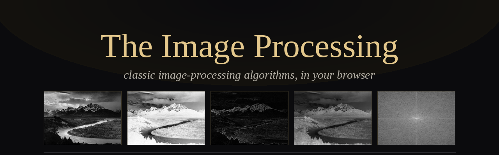
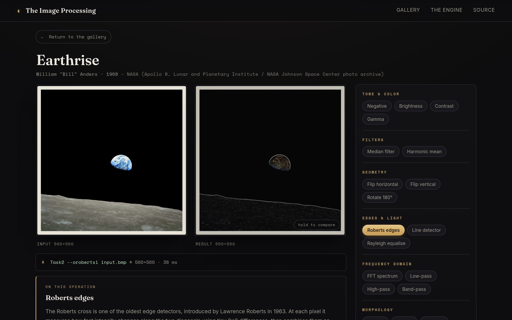
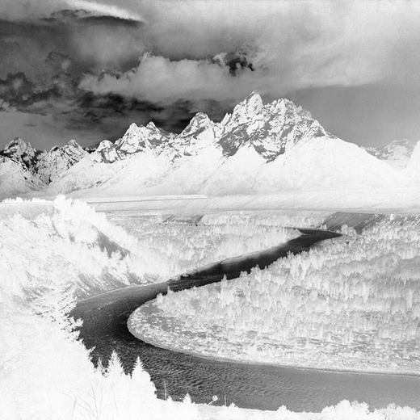
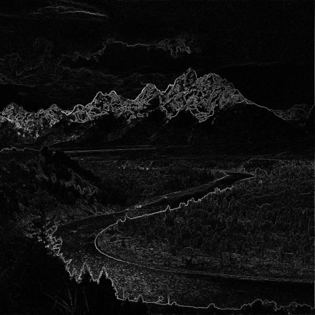
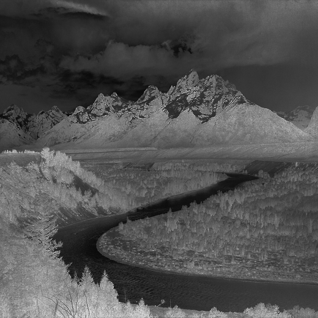
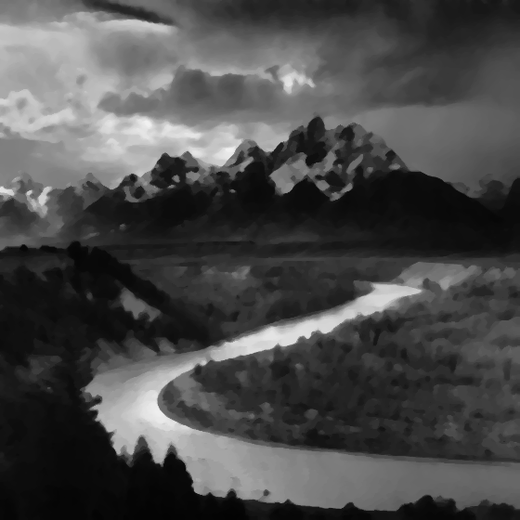
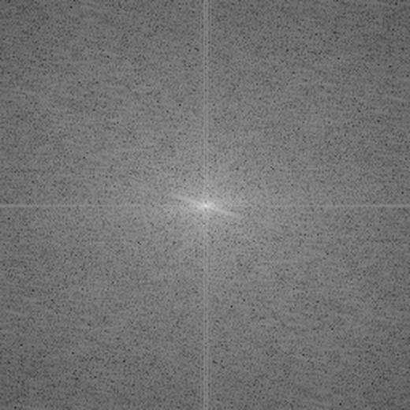

<div align="center">



### Classic image-processing algorithms, written in C++ in 2019 — running in your browser.

[**▶ &nbsp;Open the live museum**](https://szymonrucinski.github.io/Image-Processing/)

`C / C++` &nbsp;·&nbsp; `CImg` &nbsp;·&nbsp; `Emscripten` &nbsp;·&nbsp; `WebAssembly` &nbsp;·&nbsp; `vanilla JS`

</div>

---

Pick a public-domain photograph and run classic image-processing algorithms on it — brightness and
contrast, median and harmonic filters, edge and line detection, histogram equalisation, morphology,
and the Fourier domain — live, in your browser. The algorithms are the original C++ I wrote in 2019
for the Computer Vision course of my Information Technology bachelor's degree, compiled to WebAssembly
and run **unchanged**. No image is uploaded; everything happens on your machine.

<div align="center">

</div>

## Examples

Every result below is produced by the actual compiled C++, applied to Ansel Adams's
*The Tetons and the Snake River* (1942).

<table>
<tr>
<td align="center" width="33%"><br><b>Original</b><br><sub>the source photograph</sub></td>
<td align="center" width="33%"><br><b>Negative</b><br><sub>invert every pixel &nbsp;·&nbsp; g = 255 − f</sub></td>
<td align="center" width="33%"><br><b>Roberts edges</b><br><sub>2×2 diagonal gradient (1963)</sub></td>
</tr>
<tr>
<td align="center"><br><b>Rayleigh equalise</b><br><sub>redistribute tones to reveal detail</sub></td>
<td align="center"><br><b>Median filter</b><br><sub>denoise, keep edges sharp</sub></td>
<td align="center"><br><b>FFT spectrum</b><br><sub>log-magnitude Fourier transform</sub></td>
</tr>
</table>

## How it works

Each operation is the original C++ program, compiled to WebAssembly and run unchanged — driven exactly
as it would be from a terminal:

```
canvas pixels ──encode 24-bit BMP──▶ Emscripten in-memory filesystem  /input.bmp
              Module.callMain(['--orobertsi', '/input.bmp'])   ← the program's real main()
              /newOne.bmp ──decode BMP──▶ canvas
```

`-Dcimg_display=0` turns CImg's desktop-window calls into no-ops, so the original GUI code runs
harmlessly and `image.save()` still writes the result. The algorithm source is byte-for-byte
unchanged; see [`WEB-MUSEUM.md`](WEB-MUSEUM.md) for the details and the full list of operations.

## Repository

| Path | What |
|------|------|
| `Task1`–`Task4/` | the original C++/CImg programs (unchanged algorithm source) |
| `docs/` | the website — HTML/CSS/JS and the compiled `wasm/` — served by GitHub Pages |
| `build/build.sh` | compiles the four programs to WebAssembly |
| `WEB-MUSEUM.md` | what changed for the browser port; exhibited vs. omitted operations |

## Build the WebAssembly

```bash
source ~/emsdk/emsdk_env.sh      # Emscripten SDK
bash build/build.sh              # → docs/wasm/Task{1..4}.{js,wasm}
```

## Credits

Algorithms by **Szymon Ruciński** (2019). The gallery is public-domain photography — NASA, the Farm
Security Administration / Office of War Information, the U.S. National Archives (Ansel Adams's National
Park Service series) and the 1873 Wheeler Survey — sourced via the Library of Congress, the National
Archives and Wikimedia Commons.
